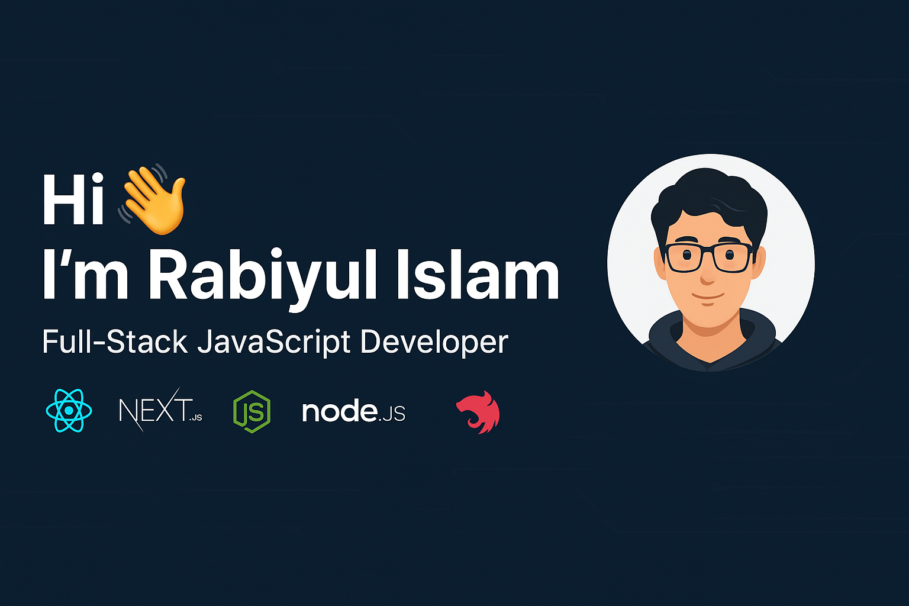

<!-- Banner -->

<h1 align="center">Hi 👋, I'm Rabiyul Islam</h1>
<h3 align="center">Full-Stack JavaScript Developer | React • Next.js • Node.js • NestJS | Bangladesh</h3>

  

---

## 🚀 About Me  
- 💼 Full-Stack Developer (React, Next.js, Node.js, NestJS)  
- 🏢 Working at **ShunnoIT**, Rajshahi  
- 🎓 CSE Student | Diploma Engineer (Software Engineering – 2022)  
- 🌱 Currently learning **Microservices, AWS, DevOps**  
- 🌐 Building SaaS, ISP Billing, and Utility Platforms  
- ⚡ Fun fact: I love solving real-world problems with clean modular architecture.

---

## 🔗 Connect With Me  

---

## 🛠️ Tech Stack  

### **Frontend**

### **Backend**

### **Tools & DevOps**

---

## 📊 GitHub Stats  

  
  

---

## 📈 Most Used Languages  

  

---

## 🧩 Featured Projects  
### ⭐ ISP Billing System  
Modern ISP billing & automation with MikroTik integration.

### ⭐ Utility Bill SaaS  
Full-stack SaaS for meter billing, tenant management, receipts & automation.

### ⭐ Full-Stack MERN/NestJS Projects  
Production-grade REST & GraphQL APIs.

---

## 🎯 Current Goals  
- Mastering AWS (EC2, S3, Lambda, CloudFront)  
- Building Microservices with RabbitMQ  
- Scaling Next.js apps for production  

---

## 🤝 Let's Build Something Awesome!  
Always open to **remote jobs, freelance projects, and collaborations.**  
Feel free to reach out! 🚀
